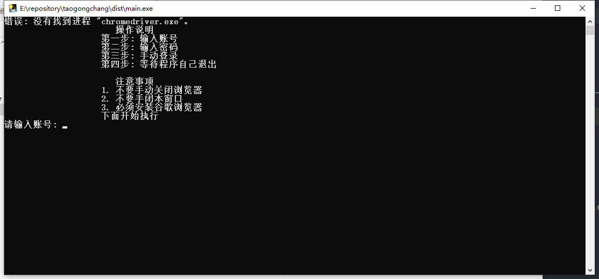

# 淘工厂采集订单工具

> 代码做了核心功能的简单抽象，其余代码较乱!

## 功能介绍

主要功能是将淘工厂后台订单按照excel模板生成对应的订单信息，简化了人工操作，减少人工，只需要手动登录就可以。
采集的字段有:

- [ ]  `快递公司`: 需要订单做测试

- [ ] `快递单号`: 需要订单做测试

- [x] `订单编号`: 需要订单做测试

-  [ ] `订单来源`: 未做解析,需要请提 issues 或者自行修改代码

-  [x] `买家昵称`:

-  [x] `收货人姓名`:

-  [x] `收货人手机号`:

-  [x] `省`:

-  [x] `市`:

-  [x] `区/县`:

-  [x] `街道地址`

-  [x] `详细信息`: (详细地址)

-  [ ] `卖家备注`: 需要订单做测试

-  [ ] `买家留言`: 需要订单做测试

-  [ ] `实付金额`: 未作解析

-  [x] `商品标题`:

-  [x] `商家编码`:

-  [x] `商品数量`:

-  [x] `商品ID`:
